# Plesk

## Préparation

Connectez vous sur votre panel plesk et allez sur la page principale


Si vous n'avez pas la même vue que moi, sélectionnez la vue dynamique en haut à droite \(bouton changer de vue\) 


Nous allons maintenant créer un sous domaine pour le launcheur

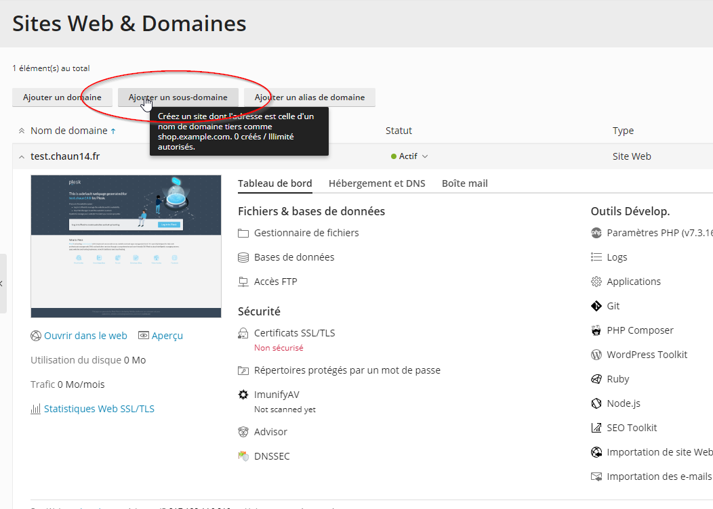

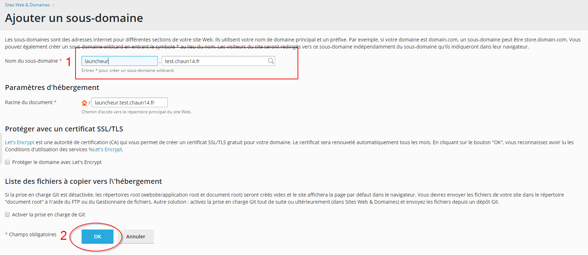

entrez le nom que vous souhaitez et appuyez sur "OK"

#### Cliquez sur le sous domaine pour le faire défiler

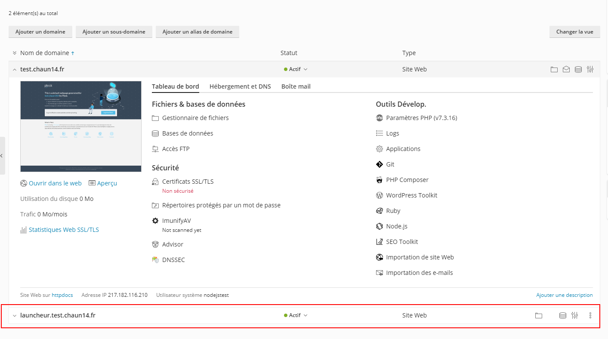

#### Allez dans le gestionnaire de fichiers

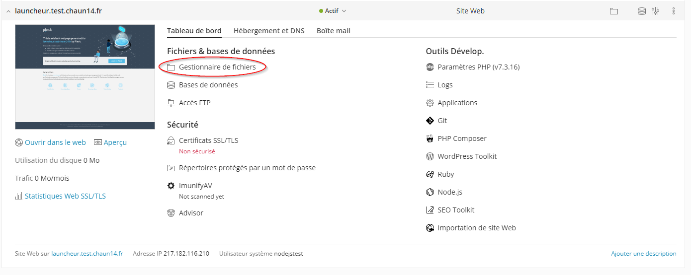

#### Cliquez sur la case à cocher pour tout sélectionner puis sur le bouton supprimer

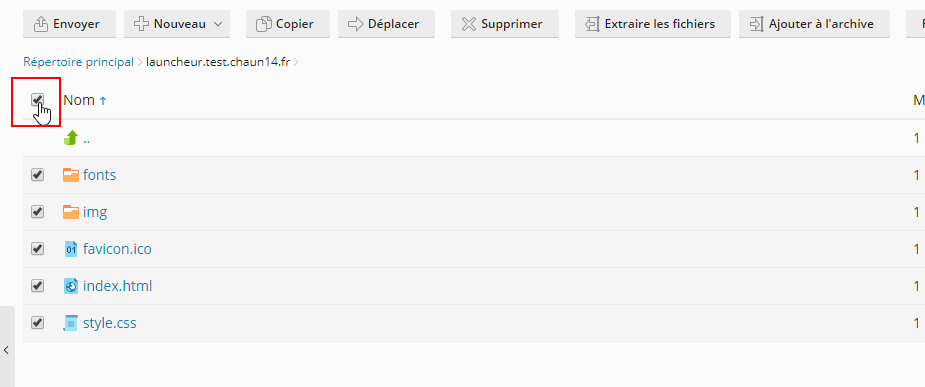

#### Téléchargeons le serveur à partir de Github

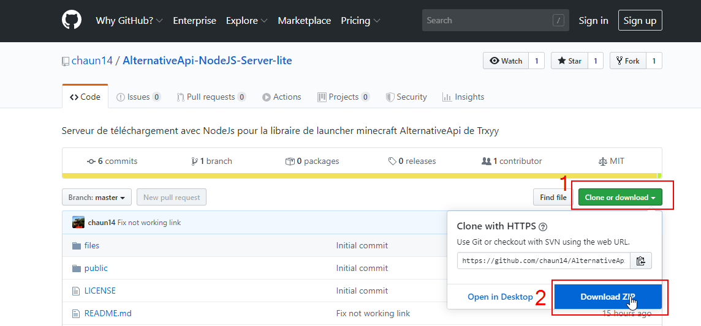

#### Extraire l'archive sur votre ordinateur

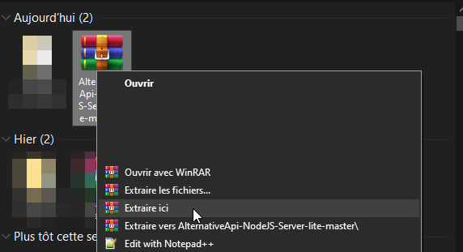

Une fois le contenu extrait, envoyez le sur le serveur via FTP \(avec Winscp par exemple\) ou via le gestionnaire de fichiers de plesk

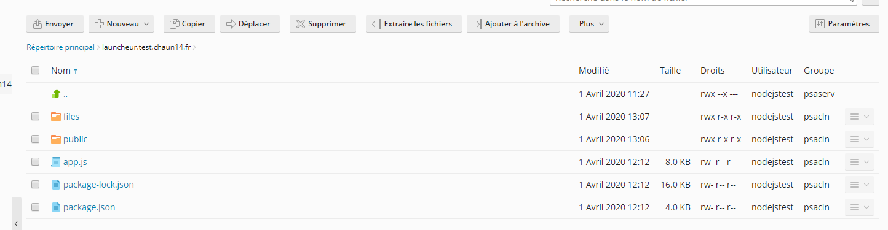


Vous aurez sans doute plus de fichier que moi \(qui finissent en .md\). Ils sont inutiles, pas besoin de les envoyer sur le serveur


## Installation

Retournez sur la page principale de plesk. Et cherchez le bouton NodeJS \(si vous ne le trouvez pas, il est possible que cette fonctionnalité ne sois pas installé, contactez votre hébergeur\)

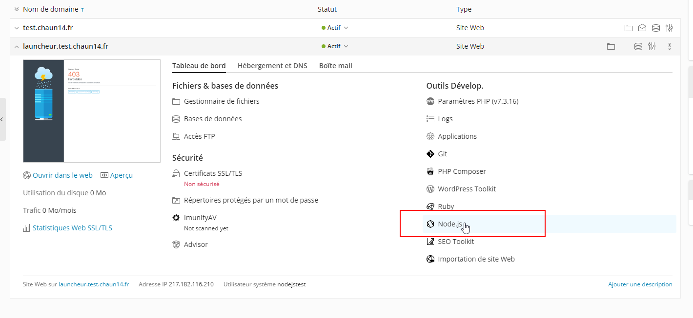

Vous arriverez sur une page comme celle là:

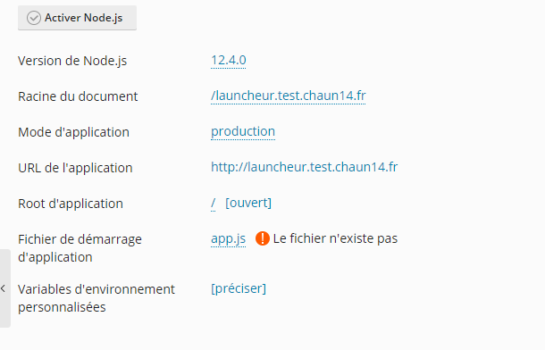

cliquez sur le `/` dans la rubrique "Root d'application" et sélectionnez votre sous domaine pour le launcheur.

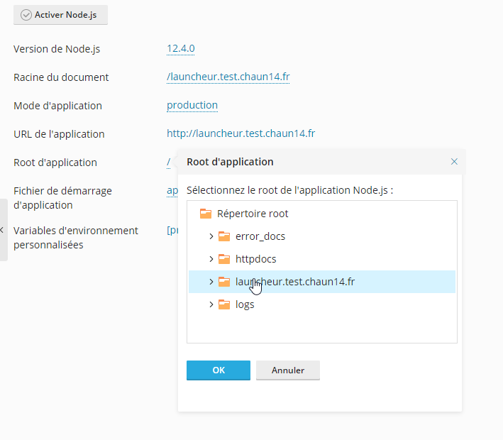

Cliquez sur `activer Node.js`

cliquez sur  `installer NPM`

Puis cliquez sur redémarrer l'app.

Une fois que tout est fait, il ne vous reste plus qu'à aller à l'adresse de votre sous domaine 

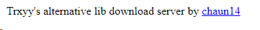


Si vous voyez ceci c'est que votre serveur de téléchargement est en place 


